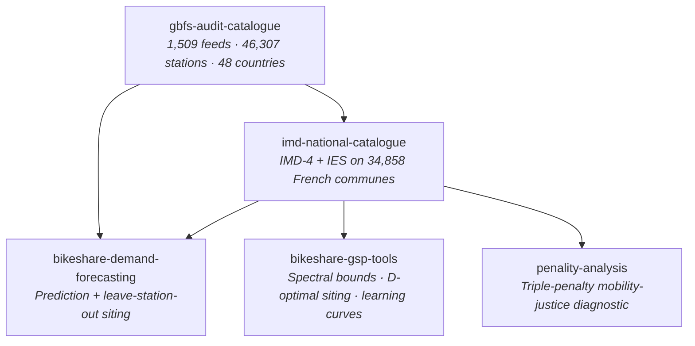

<div align="center">

# Cycling Data Lab

**Reproducible research on cycling environments, bike share demand and mobility justice.**

[](https://github.com/orgs/cycling-data-lab/repositories)
[](https://opensource.org/license/MIT)
[](#open-data-and-reproducibility)
[](https://lineact.cesi.fr)

</div>

> **By the numbers.** 34,858 French communes mapped · 1,509 global GBFS feeds audited · 37 M bike share trip observations processed · 27 networks benchmarked · 322 cycling poverty deserts identified.

## What we work on

We measure cycling environments, bike share demand and the social distribution of both, at the granularity at which French transport policy is actually decided: the commune (n = 34,858) and the station (n ≈ 50,000 across France and 6 international networks).

Three open data substrates meet here in a single research pipeline: OpenStreetMap infrastructure, GBFS station feeds, and INSEE social statistics. The pipeline produces:

1. **A reproducible audit of 1,509 GBFS feeds worldwide**, exposing the semantic ambiguities of the standard and releasing a 46 column certified catalogue across 48 countries.
2. **A commune level supply side composite indicator** (the IMD-4) that improves on the de facto French standard (Cerema cycling infrastructure density) by +18 pts R² in predicting realised commuting share.
3. **A demand prediction benchmark** on 27 dock based networks across two continents, with paired bootstrap CIs and an explicit decomposition of the +0.27 headline ΔR² into transferable spatial and station fingerprint components.
4. **A mobility justice diagnostic** that turns the indicator into a ranked, intersectional priority list of 322 cycling poverty deserts for the 2023 to 2027 Plan Vélo.
5. **A graph signal processing toolkit** that develops the spectral bounds, sampling theoretic siting and empirical learning curves which underpin the prediction work.

All released as code, data and reproducible LaTeX under MIT.

## Repository map



| Repository | Contribution | Method | Status |
|:---|:---|:---|:---|
| **[imd-national-catalogue](https://github.com/cycling-data-lab/imd-national-catalogue)** | IMD-4 cycling environment composite on 34,858 French communes | Bayesian simplex MCMC calibrated on FUB and EMP panels | v0.2 beta (Hugging Face and Zenodo planned) |
| **[bikeshare-demand-forecasting](https://github.com/cycling-data-lab/bikeshare-demand-forecasting)** | IMD augmented bike share demand prediction (temporal and leave station out) | LightGBM with paired station bootstrap (B = 1000) on a 9 network LSO panel | Working draft, pre submission |
| **[bikeshare-gsp-tools](https://github.com/cycling-data-lab/bikeshare-gsp-tools)** | Graph signal processing foundations for cycling network expansion | Symmetric Laplacian spectral bounds and D optimal greedy submodular siting (Nemhauser 1−1/e) | Early draft, theory development in progress |
| **[penality-analysis](https://github.com/cycling-data-lab/penality-analysis)** | Triple penalty mobility justice diagnostic | Deterministic intersection of three vulnerability layers on the IMD-4 substrate | Working draft, pre submission |
| **[gbfs-audit-catalogue](https://github.com/cycling-data-lab/gbfs-audit-catalogue)** | Reproducible audit of 1,509 GBFS bike share feeds across 48 countries | 46 column reference schema with an anomaly detection layer | Stable, Zenodo archived |

> **Status note.** No paper from this organisation has been peer reviewed or submitted to a journal yet. Each repo above is a self contained working draft (code, data, manuscript) released openly during the writing process so that feedback can shape the eventual submission.

## Open data and reproducibility

Every result in every repo can be reproduced from the raw open data sources:

- **[OpenStreetMap](https://www.openstreetmap.org)** (OdbL): cycling infrastructure (I axis), heavy transit stops (M axis proxy).
- **[GBFS](https://gbfs.mobilitydata.org)** feeds (provider terms): station inventory and real time status for the 27 network panel.
- **[INSEE Filosofi](https://www.insee.fr/fr/statistiques/serie/000436391)** (Licence Ouverte 2.0): commune level median income, poverty rate, part vélo travail outcome.
- **[Open Elevation](https://www.open-elevation.com)** SRTM 30 m (CC BY): topography (T axis).
- **[FUB Baromètre Vélo](https://barometre.parlons-velo.fr)**, **[EMP survey](https://www.statistiques.developpement-durable.gouv.fr/enquete-sur-la-mobilite-des-personnes-2018-2019)**, **[Cerema](https://www.cerema.fr)** cycling infrastructure inventory: calibration and comparison panels.
- **[Lyft](https://www.lyft.com/bikes)** (Bluebikes, Capital Bikeshare, Divvy, Bay Wheels), **[BIXI](https://bixi.com/en/open-data)**, **[TfL](https://cycling.data.tfl.gov.uk)**, **[Citi Bike](https://citibikenyc.com/system-data)** trip logs: 37 M observations across the Tier 1 panel.

Each repo ships:

- a `requirements.txt` pinning the Python stack;
- random seeds (typically `42`) and explicit RAM and wall time budgets per script;
- pre computed intermediate parquets to bypass long recomputations;
- a `CITATION.cff` for machine readable citation;
- an MIT `LICENSE` for the code (data products inherit upstream licenses).

## How to cite

```bibtex
@misc{cyclingDataLab,
  author       = {Foss\'e, Rohan and Pallares, Ga\"el},
  title        = {{cycling-data-lab}: open research on cycling environments,
                  bike share demand and mobility justice},
  year         = {2025},
  howpublished = {\url{https://github.com/cycling-data-lab}}
}
```

Per repo BibTeX entries are in the corresponding `README.md`.

## People

**Rohan Fossé** · Enseignant Responsable Pédagogique, CESI École d'Ingénieurs, Montpellier
[](mailto:rfosse@cesi.fr)
[](https://orcid.org/0009-0002-2195-0198)

**Gaël Pallares** · Enseignant Chercheur, CESI LINEACT (EA 7527)
[](https://orcid.org/0009-0002-8680-604X)

Affiliated with [CESI LINEACT (EA 7527)](https://lineact.cesi.fr), Montpellier, France.

## Contributing

Issues and pull requests are welcome on any of the repos. We follow a publish then discuss model: drafts are released openly during the writing process so external feedback can shape the eventual submission.

For larger collaborations (joint papers, data sharing, code contributions), email Rohan directly.

<div align="center">

*Cycling data, open by default.*

</div>
