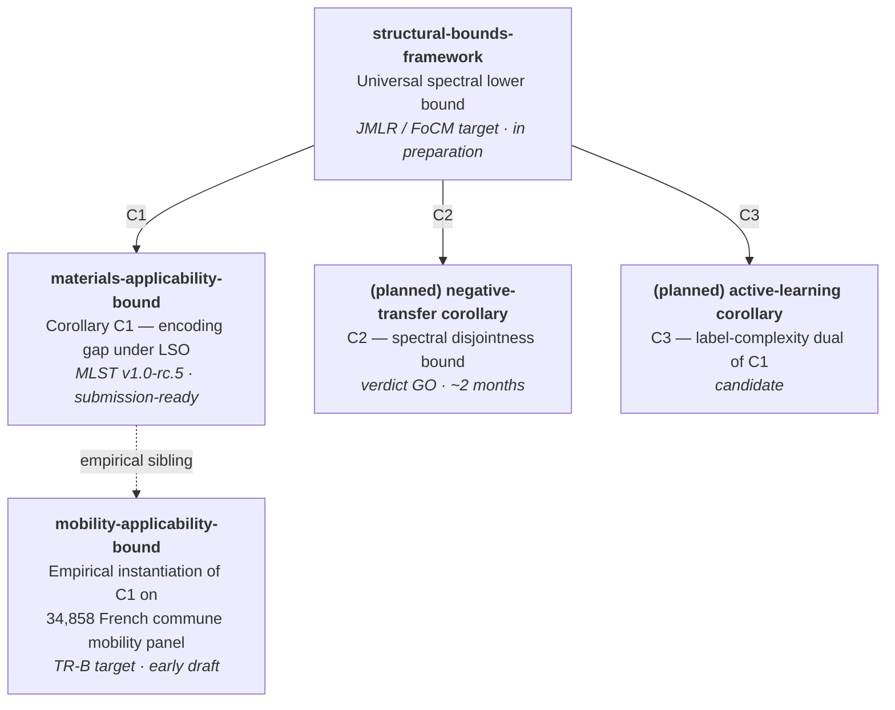
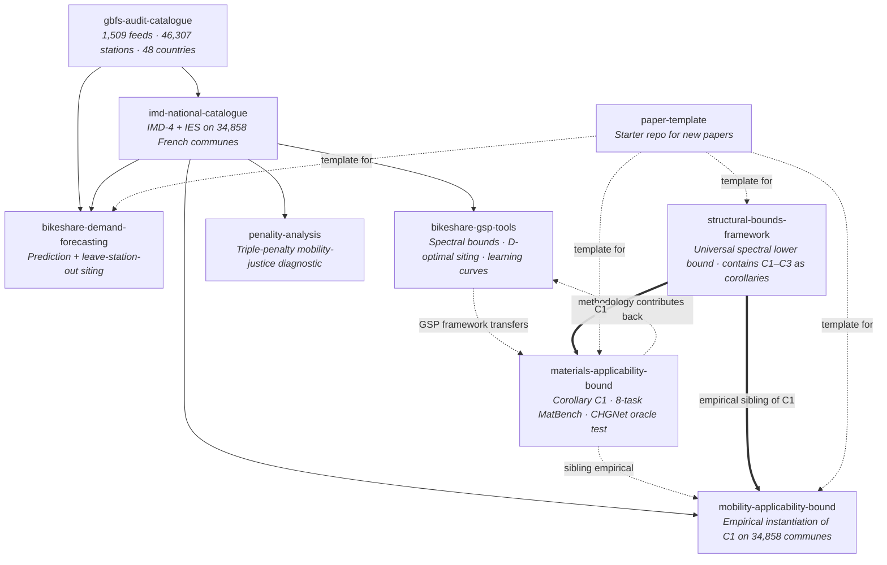

<div align="center">

# Cycling Data Lab

**A research program on structural lower bounds for graph-supervised learning — instantiated empirically on materials informatics, urban mobility, bike share demand and mobility justice.**

[](https://github.com/orgs/cycling-data-lab/repositories)
[](https://opensource.org/license/MIT)
[](#open-data-and-reproducibility)
[](https://doi.org/10.5281/zenodo.20355996)
[](https://lineact.cesi.fr)

</div>

> **By the numbers.** 34,858 French communes mapped · 1,509 global GBFS feeds audited · 37 M bike share trip observations processed · 27 bike-share networks benchmarked · 322 cycling poverty deserts identified · 8-task MatBench applicability-domain panel · one structural lower bound that connects them all.

## Theoretical program

Our central research goal is a **universal spectral lower bound** on the generalisation error of any graph-supervised learner. The bound depends only on three objects — the graph Laplacian, the target signal, and the learner's reachable feature subspace — and is independent of the regressor choice. Each empirical application in this organisation is, at the methodological level, a corollary or instantiation of this single bound.



**Shared theoretical signature.** All bounds in the program take the form
> *expected loss under evaluation protocol Π ≥ (1 − R²\_spec(𝒮\_𝒜, y)) · Var(y) − slack(Π, 𝒮\_𝒜)*,

where R²\_spec is the projection-R² of the target signal y onto the learner's reachable feature subspace 𝒮\_𝒜, computed in the eigenbasis of the graph Laplacian, and the slack term is controlled by the Pesenson sampling quality of the protocol on that subspace ([Pesenson 2008](https://arxiv.org/abs/0801.2030); [Anis–Gadde–Ortega 2016](https://arxiv.org/abs/1510.00297); the extension to arbitrary feature subspaces follows [Chepuri–Leus 2018](https://ece.iisc.ac.in/~spchepuri/publications/icassp18chepuri1.pdf), [Tanaka–Eldar 2020](https://arxiv.org/abs/1905.04441)).

**Open conjecture (saturation).** The Pesenson-ridge estimator on the restricted feature subspace saturates the bound up to O(1/n). If true, this provides an *efficient estimator* in the sense of the classical Cramér–Rao bound, completing the analogy for graph-supervised learning.

**Why the program is organised this way.** Publishing several focused corollaries alongside the universal framework yields both tactical impact (each corollary stands on its own) and strategic coherence (the program builds a recognisable theoretical lane, in the spirit of how Cramér–Rao bounds organise classical estimation theory). Cross-domain controls (cycling networks, MovieLens, materials) are an intrinsic part of the methodology, not an afterthought: every corollary is validated on at least two unrelated domains to confirm that it reflects a property of graph-supervised learning, not an artefact of any single field.

## What we work on

We measure cycling environments, bike share demand and the social distribution of both, at the granularity at which French transport policy is actually decided: the commune (n = 34,858) and the station (n ≈ 50,000 across France and 6 international networks). Methodologically, the same graph-signal-processing tools that we built for cycling network expansion turn out to apply far beyond that setting — to materials informatics ([materials-applicability-bound](https://github.com/cycling-data-lab/materials-applicability-bound), MLST submission), to urban mobility transferability ([mobility-applicability-bound](https://github.com/cycling-data-lab/mobility-applicability-bound), TR-B target), and ultimately to a unified theoretical statement ([structural-bounds-framework](https://github.com/cycling-data-lab/structural-bounds-framework)) of which the others are corollaries.

Three open data substrates meet here in a single research pipeline: OpenStreetMap infrastructure, GBFS station feeds, and INSEE social statistics. Plus, increasingly, MatBench DFT panels for the materials-side methodology work. The pipeline produces:

1. **A reproducible audit of 1,509 GBFS feeds worldwide**, exposing the semantic ambiguities of the standard and releasing a 46 column certified catalogue across 48 countries.
2. **A commune level supply side composite indicator** (the IMD-4) that improves on the de facto French standard (Cerema cycling infrastructure density) by +18 pts R² in predicting realised commuting share.
3. **A demand prediction benchmark** on 27 dock based networks across two continents, with paired bootstrap CIs and an explicit decomposition of the +0.27 headline ΔR² into transferable spatial and station fingerprint components.
4. **A mobility justice diagnostic** that turns the indicator into a ranked, intersectional priority list of 322 cycling poverty deserts for the 2023 to 2027 Plan Vélo.
5. **A graph signal processing toolkit** that develops the spectral bounds, sampling theoretic siting and empirical learning curves which underpin the prediction work.
6. **A structural lower bound on the applicability-domain gap** in materials property prediction, derived from the same GSP framework as the bike-share siting bounds, validated on 8 MatBench tasks with a foundation-model encoder-discrimination oracle test (CHGNet).
7. **An empirical instantiation of that same bound in urban mobility**, on the 34,858 French commune panel — answering the question "why do mode-choice models trained in city A fail in city B?" in the same language as the materials encoding gap.
8. **A unified theoretical framework** that contains all of the above as corollaries of a single regressor-independent spectral inequality.

All released as code, data and reproducible LaTeX under MIT, with Zenodo DOIs minted on every versioned release.

## Repository map



| Repository | Contribution | Method | Status |
|:---|:---|:---|:---|
| **[structural-bounds-framework](https://github.com/cycling-data-lab/structural-bounds-framework)** | **Universal spectral lower bound** on graph-supervised learning (contains C1–C3 as corollaries) | Pesenson sampling on arbitrary feature subspaces + Cochran finite-population identity + Talagrand-contraction Rademacher; open conjecture: Pesenson-ridge estimator saturates the bound | **In preparation**, JMLR / FoCM target |
| **[materials-applicability-bound](https://github.com/cycling-data-lab/materials-applicability-bound)** | **Corollary C1**: first regressor-independent structural lower bound on the applicability-domain gap in materials property prediction | Cochran finite-population identity + Talagrand-contraction Rademacher + Pesenson sampling, validated on 8 MatBench panels with CIG = 18× to 145× above shuffled-kNN null | **v1.0-rc.5, MLST submission-ready** (Zenodo DOI [10.5281/zenodo.20355996](https://doi.org/10.5281/zenodo.20355996)) |
| **[mobility-applicability-bound](https://github.com/cycling-data-lab/mobility-applicability-bound)** | Empirical instantiation of C1 in urban mobility (why mode-choice models trained in city A fail in city B) | Same framework as materials-applicability-bound, applied to the 34,858 French commune mobility panel | Early draft, TR-B target |
| **[imd-national-catalogue](https://github.com/cycling-data-lab/imd-national-catalogue)** | IMD-4 cycling environment composite on 34,858 French communes | Bayesian simplex MCMC calibrated on FUB and EMP panels | v0.2 beta (Hugging Face and Zenodo planned) |
| **[bikeshare-demand-forecasting](https://github.com/cycling-data-lab/bikeshare-demand-forecasting)** | IMD augmented bike share demand prediction (temporal and leave station out) | LightGBM with paired station bootstrap (B = 1000) on a 9 network LSO panel | Working draft, pre submission |
| **[bikeshare-gsp-tools](https://github.com/cycling-data-lab/bikeshare-gsp-tools)** | Graph signal processing foundations for cycling network expansion | Symmetric Laplacian spectral bounds and D optimal greedy submodular siting (Nemhauser 1−1/e) | Early draft, theory development in progress |
| **[penality-analysis](https://github.com/cycling-data-lab/penality-analysis)** | Triple penalty mobility justice diagnostic | Deterministic intersection of three vulnerability layers on the IMD-4 substrate | Working draft, pre submission |
| **[gbfs-audit-catalogue](https://github.com/cycling-data-lab/gbfs-audit-catalogue)** | Reproducible audit of 1,509 GBFS bike share feeds across 48 countries | 46 column reference schema with an anomaly detection layer | Stable, Zenodo archived |
| **[paper-template](https://github.com/cycling-data-lab/paper-template)** | Starter directory for new papers in this organisation | LaTeX + iopjournal.cls + numbered experiment scripts + reproducibility infrastructure + Zenodo metadata, all wired by default | Template repo |

> **Status note.** As of May 2026, [materials-applicability-bound](https://github.com/cycling-data-lab/materials-applicability-bound) is the first manuscript from this organisation reaching submission-ready state (MLST, IOP Publishing). The unified framework ([structural-bounds-framework](https://github.com/cycling-data-lab/structural-bounds-framework)) is in active preparation; planned negative-transfer (C2) and active-learning (C3) corollaries will follow as standalone repos once their drafts mature. The other working drafts are released openly during the writing process so that feedback can shape the eventual submission.

## Open data and reproducibility

Every result in every repo can be reproduced from the raw open data sources:

- **[OpenStreetMap](https://www.openstreetmap.org)** (OdbL): cycling infrastructure (I axis), heavy transit stops (M axis proxy).
- **[GBFS](https://gbfs.mobilitydata.org)** feeds (provider terms): station inventory and real time status for the 27 network panel.
- **[INSEE Filosofi](https://www.insee.fr/fr/statistiques/serie/000436391)** (Licence Ouverte 2.0): commune level median income, poverty rate, part vélo travail outcome.
- **[Open Elevation](https://www.open-elevation.com)** SRTM 30 m (CC BY): topography (T axis).
- **[FUB Baromètre Vélo](https://barometre.parlons-velo.fr)**, **[EMP survey](https://www.statistiques.developpement-durable.gouv.fr/enquete-sur-la-mobilite-des-personnes-2018-2019)**, **[Cerema](https://www.cerema.fr)** cycling infrastructure inventory: calibration and comparison panels.
- **[Lyft](https://www.lyft.com/bikes)** (Bluebikes, Capital Bikeshare, Divvy, Bay Wheels), **[BIXI](https://bixi.com/en/open-data)**, **[TfL](https://cycling.data.tfl.gov.uk)**, **[Citi Bike](https://citibikenyc.com/system-data)** trip logs: 37 M observations across the Tier 1 panel.
- **[MatBench v0.1](https://hackingmaterials.lbl.gov/matminer/)** + **[Materials Project](https://materialsproject.org)** + **[CHGNet pretrained](https://github.com/CederGroupHub/chgnet)**: 8-task DFT panel and foundation-model crystal embeddings (materials methodology side).

Each repo ships:

- a `requirements.txt` pinning the Python stack;
- random seeds (typically `42`) and explicit RAM and wall time budgets per script;
- pre computed intermediate parquets to bypass long recomputations;
- a `CITATION.cff` for machine readable citation;
- a `.zenodo.json` for automatic DOI minting on each GitHub Release;
- an MIT `LICENSE` for the code (data products inherit upstream licenses).

New repos in this organisation should be created from [paper-template](https://github.com/cycling-data-lab/paper-template), which ships all of the above plus a starter LaTeX manuscript in the IOP `iopjournal.cls` style.

## How to cite

```bibtex
@misc{cyclingDataLab,
  author       = {Foss\'e, Rohan and Pallares, Ga\"el},
  title        = {{cycling-data-lab}: a research program on structural lower bounds
                  for graph-supervised learning, with empirical instantiations in
                  materials informatics, urban mobility, bike share demand and
                  mobility justice},
  year         = {2026},
  howpublished = {\url{https://github.com/cycling-data-lab}}
}
```

Per repo BibTeX entries are in the corresponding `README.md`.

## People

**Rohan Fossé** · Enseignant Responsable Pédagogique, CESI École d'Ingénieurs, Montpellier
[](mailto:rfosse@cesi.fr)
[](https://orcid.org/0009-0002-2195-0198)

**Gaël Pallares** · Enseignant Chercheur, CESI LINEACT (EA 7527)
[](https://orcid.org/0009-0002-8680-604X)

Affiliated with [CESI LINEACT (EA 7527)](https://lineact.cesi.fr), Montpellier, France.

## Contributing

Issues and pull requests are welcome on any of the repos. We follow a publish then discuss model: drafts are released openly during the writing process so external feedback can shape the eventual submission.

For larger collaborations (joint papers, data sharing, code contributions), email Rohan directly.

<div align="center">

*One spectral lower bound, several empirical domains — and the data, code and LaTeX to reproduce every claim.*

</div>
